# Relay — Autonomous Software Delivery, End to End

> **Demo showcase.** This repository contains screenshots and a walkthrough of **Relay**, a platform that takes a plain-language request — filed from Slack or a dashboard — and autonomously plans it, builds it, reviews it, security-checks it, proves it against a testable contract, deploys it to a live staging environment, and holds it at a single human **"Push to prod"** gate.
>
> No source code is included here — this is a product tour.

---

## What Relay is

Relay turns a one-line feature or bug request into a shipped change, with a person in the loop only where it matters.

A request flows through a pipeline of specialized AI agents:

```
 Request  →  Plan  →  Build  →  Review + Security + Verify  →  Staging  →  [ Push to prod ]
 (Slack /     the        a dynamic graph of agents            live on       one human gate
  dashboard)  planner     that write, review & prove          a preview     — migrations +
              drafts      the change against a contract        URL           merge + deploy
```

Every stage runs a real coding agent with its own model, tool allow-list and turn budget. The work happens on an isolated branch; nothing touches production until a human approves the final gate.

---

## The core ideas

**A dynamic node graph, not a fixed script.** For each ticket, a root orchestrator *plans the whole graph* — investigation → contract → implementation → review → security → verification — picking as many nodes and sub-agents as the work needs. Read-only nodes run in parallel; implementation nodes run concurrently in isolated worktrees and merge back; failures trigger bounded **repair sub-chains** that re-plan and retry.

**Testable contracts.** Before any code is written, a `contract` node writes the ticket's *done-checklist* — one exact, checkable assertion per acceptance criterion (a command + expected output, an endpoint response, a visible UI effect). The verifier grades each item `pass / fail / unknown`, and anything never graded stays **`not_recorded`** — the system refuses to claim work it didn't prove.

**Staging-first, one gate.** Every change deploys to a per-project staging stack and waits at a single **Push to prod** gate. Approving it applies database migrations, merges the PR, and redeploys production.

**Connect from anywhere.** Each project has a one-paste command that clones the repo and connects Relay to Claude Code as an MCP server with a browser-based login — so you can drive tickets from your own editor.

---

## Walkthrough

### Board — mission control
Every ticket across every project, with live status, a pipeline mini-map, and who filed it.

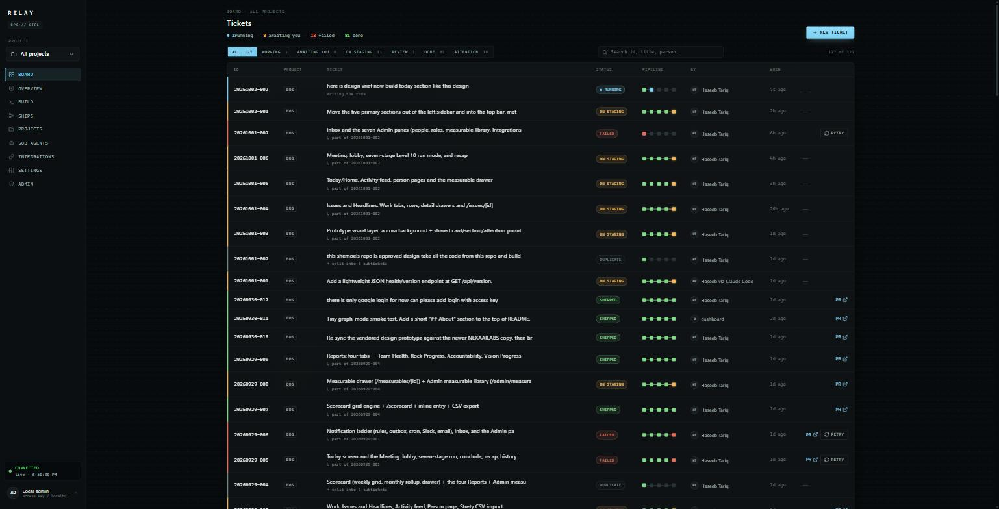

### Project Overview
A per-project home: the live URL, the repository, and a single copy-paste command that clones the project and connects it to Claude Code — plus a per-project assistant that answers questions about how the project is built and deployed.

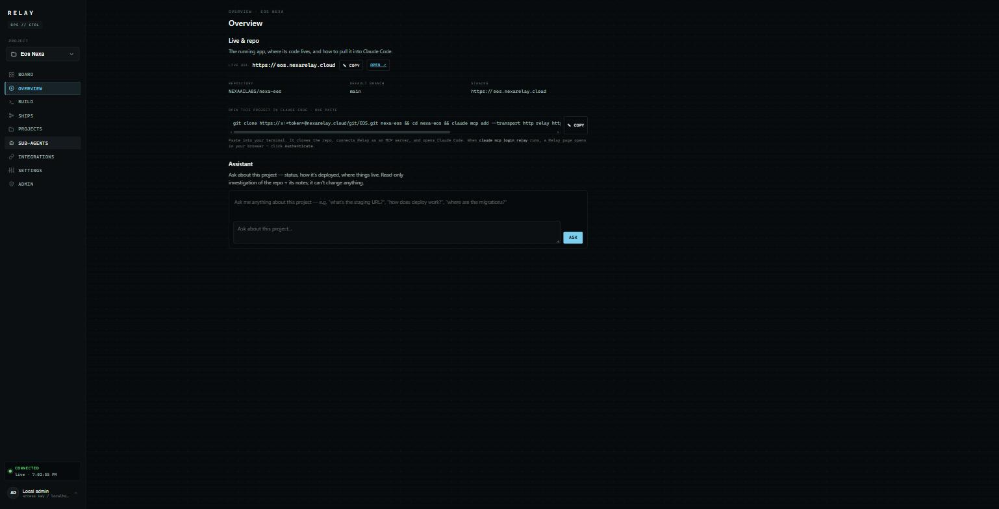

### The ticket — a live node graph
Open a ticket and you see the orchestrator's plan executed as a graph: each node (investigation, contract, implement, review, security, verification) with its own cost and status, the **repair sub-chains** that re-planned around failures, and the pipeline stepper tracking Plan → Build → Review+verify → Push → Pull request.

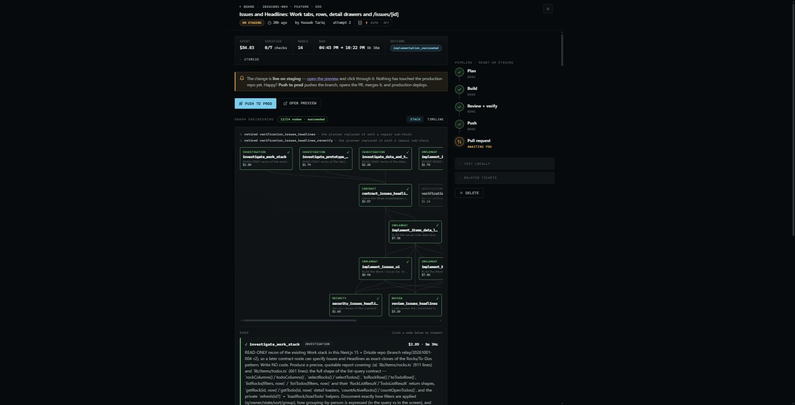

### The contract — grounded "done"
The same ticket's testable contract: one assertion per criterion, each tagged by category and how it's verified. The note at the bottom says it plainly — *an item marked `not_recorded` was never graded; never report it as working.*

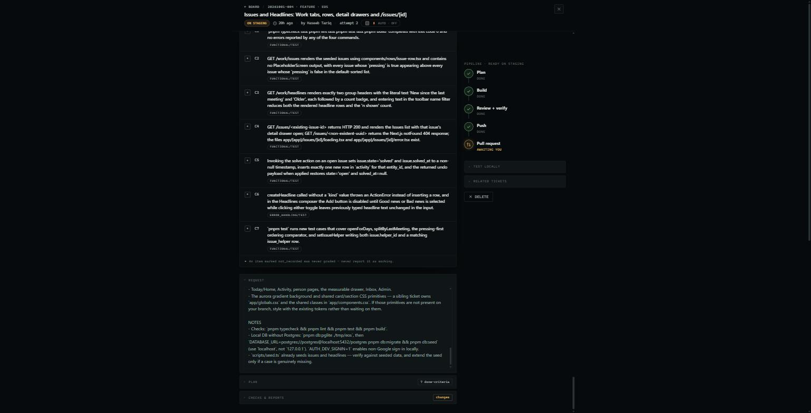

### Ships — the delivery ledger
Everything that reached a pull request, grouped by day, with staging and PR links — the audit trail of what shipped and when.

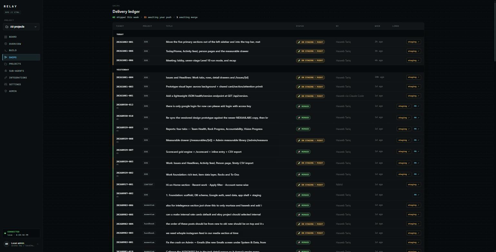

### Projects
Each repo Relay operates on — GitHub repo, default branch, Slack channel, and its build/proof configuration.

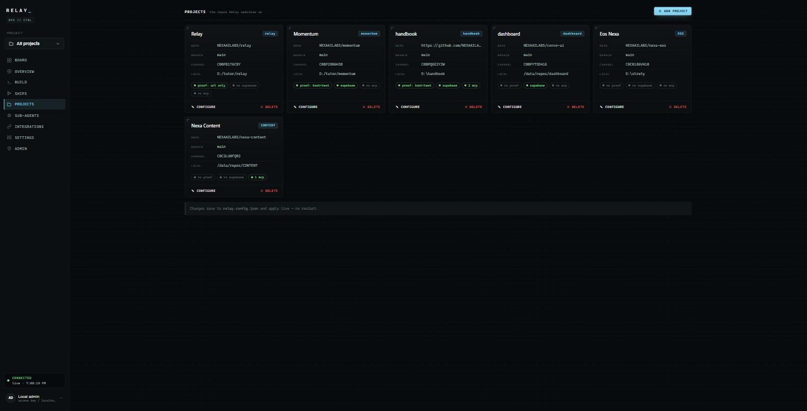

### Sub-agents
The specialist roster the planner and builder fan out to: cheap read-only explorers that scout the repo, a parallel batch-implementer, and adversarial review/security lenses — each with its own model tier, tool allow-list and turn budget.

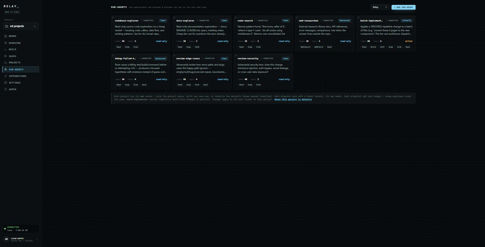

### Integrations
What Relay is connected to — Slack, GitHub, the Claude engine, Supabase, and MCP tool servers handed to every agent on every stage.

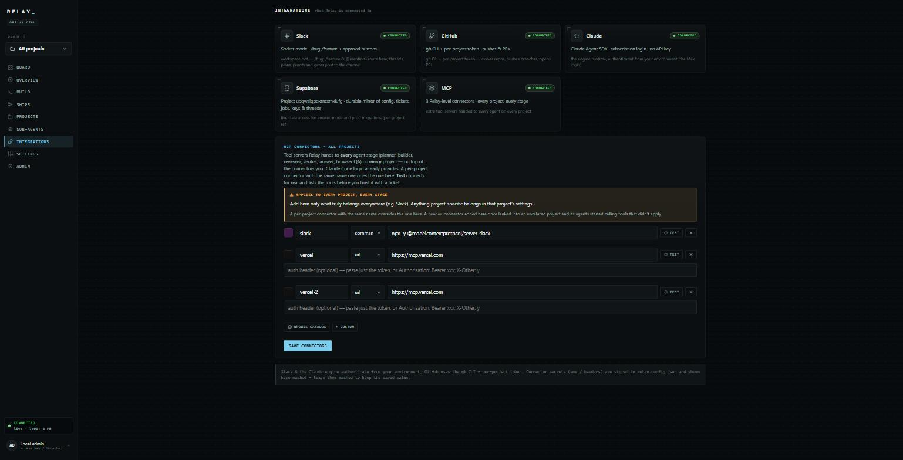

### Settings — models & guardrails
Each pipeline stage runs its own Claude model (by alias, capability tier, or exact id), with cost and turn-budget ceilings as guardrails.

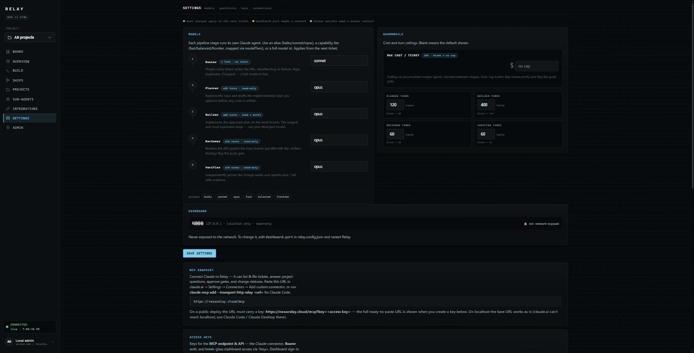

### Build — a real Claude Code terminal
An embedded Claude Code CLI for hands-on work against any project's checkout, right from the dashboard.

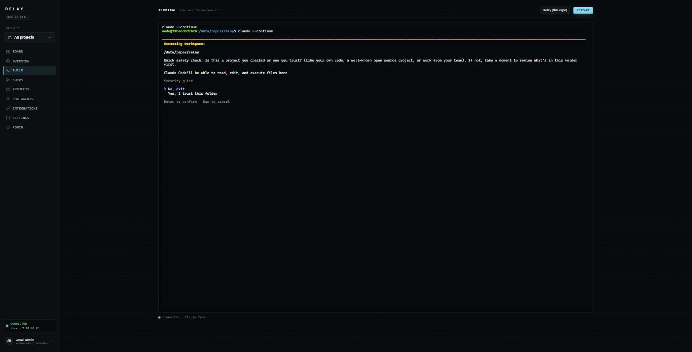

### Admin — access & roles
Per-person roles (reporter / approver / admin) across Google sign-in and the mirrored Slack roster, so the right people can file, approve gates, or administer.

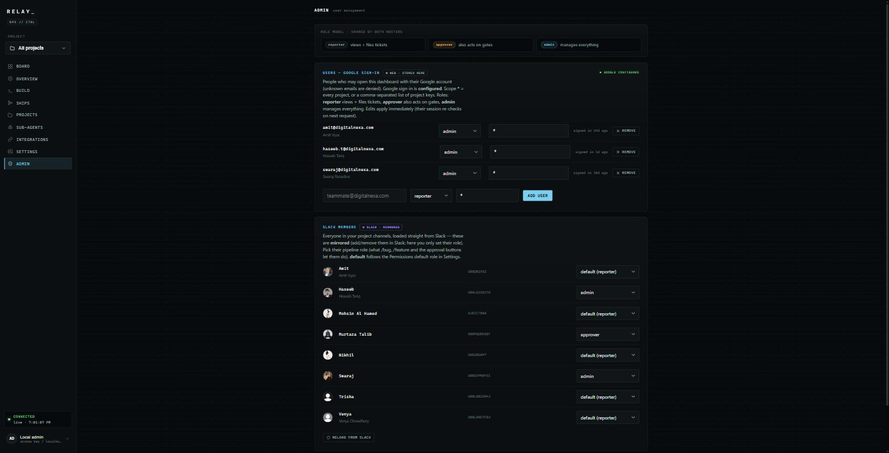

### Sign-in
Access is limited to authorized accounts.

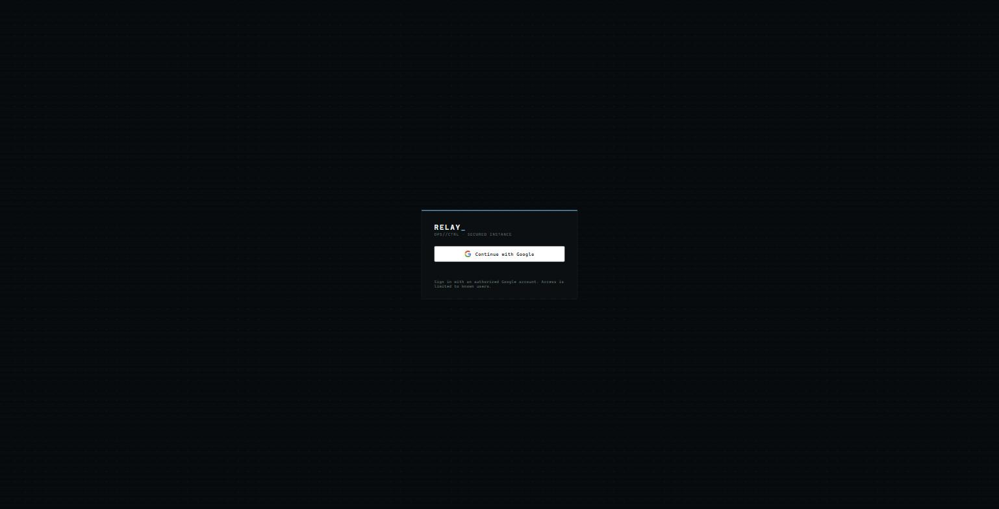

---

## How a change ships, step by step

1. **File it** — `/bug` or `/feature` in Slack, or "New ticket" on the dashboard, in plain language.
2. **Plan** — the planner explores the repo read-only and drafts the approach; a router dedupes against open work.
3. **Build (graph)** — the orchestrator plans and runs the node graph: recon → contract → parallel implementation → review → security → verification, repairing around failures.
4. **Prove** — the verifier runs the project's own tests/build and grades the contract, item by item.
5. **Staging** — the change deploys to the project's staging stack with a live preview URL.
6. **Push to prod** — one human gate: approving it runs migrations, merges the PR, and redeploys production.

---

*Relay is an internal autonomous-delivery platform. This repository is a visual demo only — it contains no source code.*
